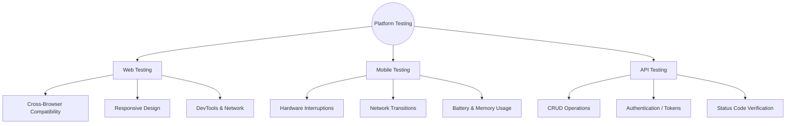

# 🗺️ Mindmap: Platform Testing Checklists (Web, Mobile, API)

## 📌 Overview
This mindmap serves as a high-level reference guide for test planning across different application tiers. It highlights the unique testing areas and potential bottlenecks specific to Web interfaces, Mobile devices, and Backend APIs.

---

## 🧠 Comprehensive QA Mindmap

## 🔑 Key Focus Areas Explained
### 💻 1. Web Testing
Testing web applications focuses heavily on how the browser renders the application and how the user interacts with the DOM.

Cross-Browser: Ensuring consistent behavior across Chrome, Firefox, Safari, and Edge.

Responsiveness: Validating layout adjustments across Desktop, Tablet, and Mobile viewports.

DevTools: Monitoring network requests, console errors, and local storage state.

### 📱 2. Mobile Testing (iOS / Android)
Mobile testing requires dealing with hardware constraints and native OS behaviors that don't exist on the web.

Interruptions: How the app handles incoming calls, alarms, or low-battery prompts while in use.

Network Transitions: App stability when switching from Wi-Fi to Cellular, or dropping into "Airplane Mode".

Resource Usage: Monitoring excessive battery drain or memory leaks during prolonged usage.

### 🔌 3. API Testing (Backend)
API testing focuses on the business logic, data contracts, and security without a graphical interface.

Payload Validation: Ensuring JSON/XML structures match the expected schema and data types are strict.

Authentication: Verifying that unauthorized requests are blocked (401 / 403) and tokens are validated.

Rate Limiting: Checking server resilience against brute-force or high-frequency requests (429 Too Many Requests).

### 🛠 Tools for these Platforms
Web: Chrome DevTools, BrowserStack.

Mobile: Android Studio (Emulator), Xcode (Simulator), Real Devices.

API: Postman, SoapUI, Swagger.

[⬅️ Back to Mindmaps Index](./)
