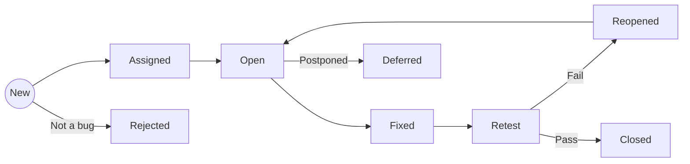

# 🗺️ Bug Lifecycle Mindmap

## 📌 Overview
This mindmap illustrates the standard workflow of a defect from its discovery to final resolution. Understanding this flow is essential for efficient collaboration between QA and Development teams.

---

## 🖼️ Mindmap Visualization
> **Tip:** I used a visual approach to map all possible transitions, including negative scenarios like "Reopened" or "Rejected".

### Bug Lifecycle Flow

---

## 🔑 Key States Explained

1. **NEW:** A bug is logged by QA and enters the backlog.
2. **ASSIGNED:** Responsibility is taken by a developer.
3. **FIXED:** The developer has committed code changes.
4. **RETEST:** QA verifies the fix in the testing environment.
5. **REOPENED:** If the fix doesn't work, the bug goes back to the developer.
6. **CLOSED:** The final stage after successful verification.
7. **DEFERRED:** The bug is valid but will be fixed in a later sprint/release.

---

## 🛠 Tools Used
* **XMind / MindMeister** (for visual design)
* **Mermaid.js** (for documentation as code)

---
[⬅️ Back to Mindmaps Index](./)