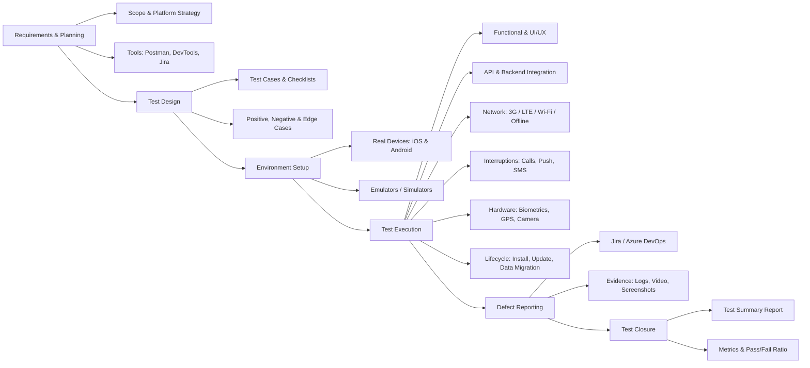

# 📱 Mindmap: Comprehensive Mobile Application Testing

## 📌 Overview
Mobile application testing requires a unique approach compared to web testing due to hardware constraints, diverse operating systems, and fluctuating network conditions. This mindmap outlines the core testing types required to ensure a stable and user-friendly mobile experience.

---

## 🧠 Mobile Testing Strategy Mindmap

## 🔑 Phase Highlights
Test Design: Mapping business requirements to actionable test scenarios, ensuring both iOS App Store guidelines and Android fragmentation are considered.

API & Backend Integration: Verifying mobile app communication with the server, including payload validation and token expiration (OAuth/JWT).

Mobile-Specific Execution: Simulating real-world conditions like dropping network signals, backgrounding the app, and verifying biometric fallback mechanisms (FaceID to PIN).

Defect Reporting: Providing developers with clear steps to reproduce, device logs, and screen recordings via Jira or Azure DevOps.

[⬅️ Back to Mindmaps Index](./README.md)