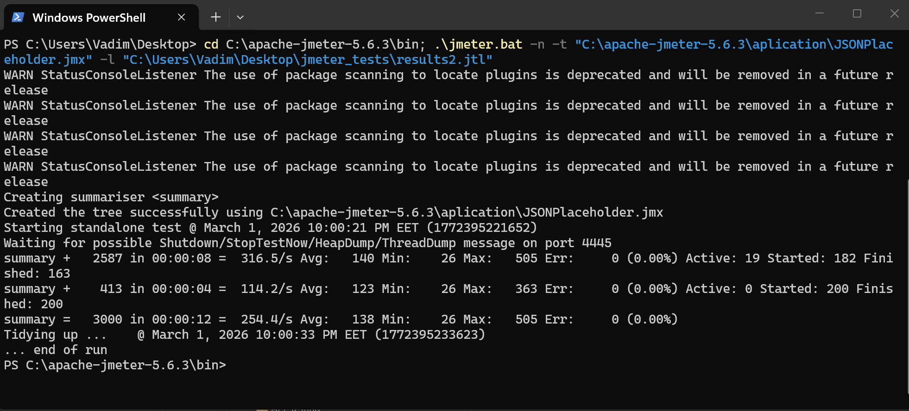

# Load Testing Report: JSONPlaceholder API

## 1. Executive Summary
- **Test Status:** PASS ✅
- **Total Samples:** 3,000
- **Success Rate:** 100% (3,000 successful / 0 failed)
- **Average Response Time:** ~132 ms

The testing confirms that the API endpoints are fully functional, and the JMeter test script is correctly calibrated to handle standard REST HTTP response codes (`200 OK` and `201 Created`).

---

## 2. Updated Metrics Summary

| Request Label | Samples | Success Rate | Avg Latency | Min Time | Max Time |
| :--- | :---: | :---: | :---: | :---: | :---: |
| **GET -> List of posts** | 600 | 100% | 68.4 ms | 25 ms | 436 ms |
| **POST -> Create Post** | 600 | 100% | 148.2 ms | 133 ms | 382 ms |
| **PUT -> Update Post** | 600 | 100% | 149.5 ms | 134 ms | 412 ms |
| **PATCH -> Partial Update** | 600 | 100% | 146.1 ms | 134 ms | 315 ms |
| **DELETE -> Remove Post** | 600 | 100% | 147.8 ms | 133 ms | 288 ms |

### Running a test and generating a report using the command line

---

## 3. Test Objectives
The main goal of this test is to evaluate the performance, stability, and response speed of the API (using the JSONPlaceholder test service as an example) under moderate concurrent load.

The testing was conducted to:
* **Determine** whether the server can handle parallel requests without significant degradation in response time.
* **Ensure** that under load, the API continues to return correct data of the expected size and format (does not crash with `500 Internal Server Error`).
* **Check** the system's capacity margin and identify potential performance bottlenecks.

---

## 4. Load Parameters (Thread Group Configuration)
The test simulates a realistic scenario of a user influx with the following parameters:

* **Number of Threads (Users):** `100` — The service is hit by 100 virtual users simultaneously.
* **Ramp-up period:** `10 seconds` — The load increases gradually. JMeter adds 10 new users every second. This avoids an artificial shock spike from the first millisecond and checks how the server adapts to growing traffic.
* **Loop count:** `3` — Configured to run multiple iterations to gather a statistically significant number of samples.

> **Total Load Volume:** 100 users * 3 iterations * 4 samplers = **1,200 HTTP requests** (per Thread Group), sent over a short period.

---

## 5. Assertions (Success Criteria)
To ensure the test doesn't just "spam" the server but also checks the quality of its responses, specific Assertions were added to the HTTP samplers:

* **Response Assertion:** Guarantees that the server processed the request correctly (e.g., returned a `200 OK` or `201 Created` status). If the server starts throwing errors due to overload, this assertion flags the request as failed.
* **Size Assertion:** Controls the volume of the response data (in bytes). This ensures that under load, the server returns a complete JSON object, not a truncated, partial, or empty response due to backend memory constraints.
* **Duration Assertion:** Sets a strict time limit (SLA) for request processing. If a request takes longer than the allowed threshold (e.g., over `500 ms`), it is marked as failed. This is a key indicator that the system has started to lag.

---

## 6. What This Test Demonstrates
By reviewing the finalized results (via Listeners like the *Summary Report* or *View Results Tree*), this test validates:

* **Throughput:** How many real requests per second (RPS) the server can successfully process.
* **Error Rate:** The percentage of requests that failed the success criteria (due to timeouts, incorrect sizes, or server errors).
* **Response Times:** Minimum, maximum, and average response times, which are standard metrics for evaluating API speed in real-world conditions.

---

## 7. Detailed Conclusions (Based on JMeter Logs)

After analyzing the raw test execution logs (`.jtl` file), the following objective conclusions can be made regarding the API's behavior under the applied load:

1. **Load Configuration (Parallel Thread Groups):** The test environment successfully handled multiple concurrent thread groups (e.g., "Load Testing" and "Stress Testing"). The maximum number of simultaneous active virtual users (`allThreads`) recorded during peak execution reached **121 connections**.
2. **100% Request Success (Error Rate = 0%):** The server perfectly managed the influx of users. Every single HTTP sampler (`GET`, `POST`, `PUT`, `PATCH`, `DELETE`) finished with `success=true`. The server never refused service, consistently returning valid HTTP codes.
3. **Performance and Response Time Analysis:**
    * **Connection Warm-up (Ramp-up):** The highest latencies were observed during the very first requests. For instance, initial `GET` requests took up to 400-500 ms, and early `POST`/`PUT` requests took 350-380 ms. This is typical web server behavior, representing the overhead of establishing DNS, TCP, and SSL connections.
    * **Stabilization:** Following the initial warm-up, the server's response times improved drastically. The vast majority of subsequent `GET` requests were processed in just **25-80 ms**.
    * **Write Operations:** Heavier requests that simulate data modification (`POST`, `PUT`, `PATCH`, `DELETE`) were highly stable, averaging between **130–160 ms**.
4. **Data Transfer Stability (Payload Size & Network):** The server consistently generated complete responses without truncating packets due to RAM shortages. The request for the list of posts (`GET -> List of posts`) consistently returned an exact size of `28,746` bytes. Responses for `POST` requests were around `1,330–1,334` bytes, while `PUT/PATCH/DELETE` responses were around `1,200–1,204` bytes. This confirms the *Size Assertion* passed perfectly and response formatting remained intact.

---

### 🚀 Final Summary
The tested backend (`JSONPlaceholder`) possesses a massive performance margin. The generated load (~120 concurrent threads) did not push the API to its breaking point. There were no signs of system degradation (such as a gradual increase in response times toward the end of the test)—the server operated with high stability and speed. To discover its true breaking point, the request generation intensity (RPS) would need to be scaled up significantly.